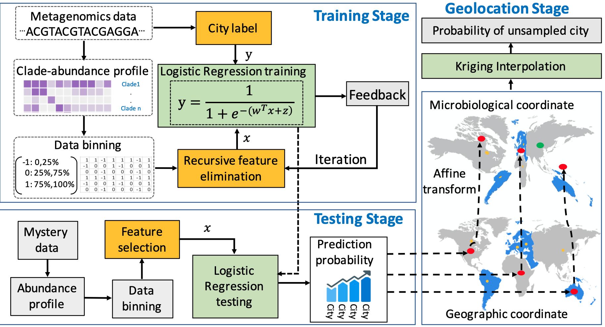

# A Machine Learning Framework to Determine Geolocations from Metagenomics Profiling
### Background
Studies on metagenomic data of environmental microbial samples found that microbial communities seem to be geolocation-specific, and the microbiome abundance profile can be a differentiating feature to identify samples' geolocations. 
We present a machine learning framework to determine the geolocations from metagenomics profiling of microbial samples.

### Framework

#### Data Downloaded and Preprocess
We downloaded the raw metagenomic sequencing data from the [CAMDA 2019 Metagenomics Forensic Challenge](http://camda2019.camda.info/) provided by CAMDA in partnership with MetaSUB International Consortium. And the raw metagenomic sequencing data were preprocessed by [**fastp** (v.0.19.4)](http://opengene.org/fastp/fastp) for quality control including automatic filtering, trimming, and error removing. 
